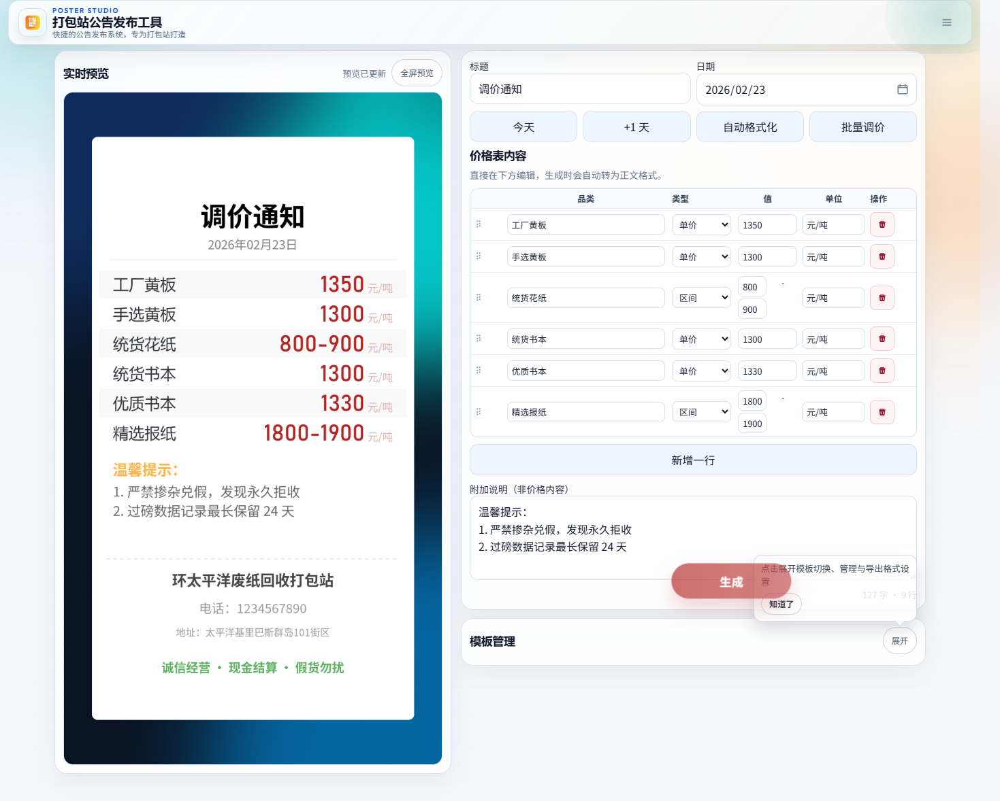
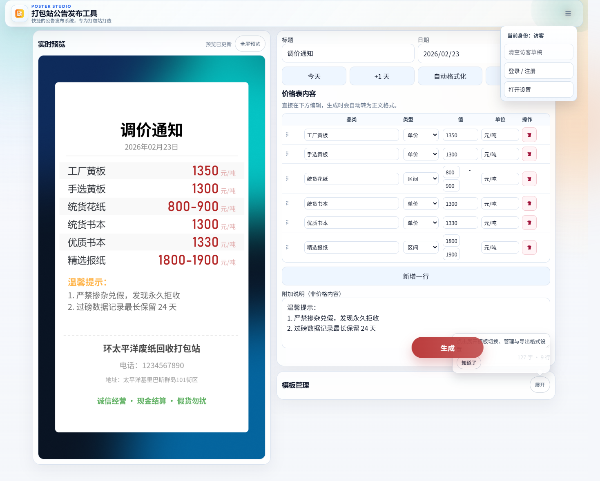
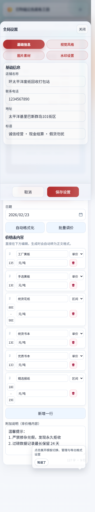

# Poster Studio

> 打包站公告海报生成工具（Web）

[](#)
[](#)
[](#)

## ✨ 项目简介

Poster Studio 是一款面向打包站与中小商家的公告海报生成工具，支持实时预览、模板复用、批量调价和一键导出，适合高频公告发布场景。  
你可以快速输入当天价格信息，生成规范海报并直接下载或分发。

## 🖼️ 界面截图

### 1) 首页（桌面端）


### 2) 设置面板


### 3) 首页（移动端）


## 🚀 核心功能

- 🧩 模板管理：系统模板 + 自定义模板（保存、切换、删除）
- 👀 实时预览：输入即预览，支持全屏查看
- 💹 价格编辑：结构化价格表、拖拽排序、批量调价
- 🎨 视觉设置：主题色、卡片样式、背景参数、印章参数
- 🖼️ 素材上传：背景图 / Logo / 印章 / 二维码（含裁剪）
- 🛡️ 账号与草稿：访客草稿、本地续编、登录后继续编辑
- 📦 多格式导出：`PNG` / `JPEG` / `PDF`

## 🛠️ 快速启动

### 1. 安装依赖
```bash
py -m pip install -r requirements.txt
```

### 2. 启动服务
```bash
py app.py
```

### 3. 打开浏览器
访问：`http://127.0.0.1:5173`

## 📂 目录结构

```text
.
├─ app.py                  # Web 服务入口
├─ poster_engine.py        # 海报渲染核心
├─ templates/              # 页面模板
├─ static/                 # 前端脚本与样式
├─ presets/                # 背景预设资源
├─ fonts/                  # 字体资源
├─ web_data/               # 配置、上传与导出数据
└─ tests/                  # 自动化测试
```

## 📦 数据位置

- 全局配置：`web_data/web_config.json`
- 上传目录：`web_data/uploads/`
- 导出目录：`web_data/outputs/`

## 🔐 合规与安全

- 提供用户协议与隐私政策页面入口
- 上传素材有类型与体积限制
- 包含安全与回归测试（见 `tests/`）

## 🧪 测试

```bash
pytest -q
```

## 📘 相关文档

- Web 使用说明：`README_WEB.md`
- 部署说明：`DEPLOY.md`
- 更新日志：`CHANGELOG.md`
